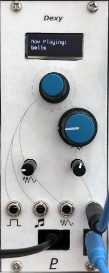

# Dexy

## Digital FM Voice in a 10HP Eurorack Module

_DX7-inspired FM synthesis with a Raspberry Pi Pico_

This is not a Yamaha DX7 clone, but it uses similar operators and algorithms
to create a single FM voice. It has pitch and timbre modulation, onboard patch
storage, and a USB connection that talks to custom patch editing software.

This module requires a 16-pin Eurorack power cable that supplies +5 V power in addition to +12 V and -12 V.

Part of my [homebrew Eurorack synthesizer](https://len42.github.io/Synth/).

### Features

- Single FM voice loosely based on the Yamaha DX7's 6-operator voice architecture
- Inputs: Gate, pitch (1V/oct), pitch mod, timbre mod
- Attenutators on the modulation inputs
- Gate and 1V/oct inputs can default to the Eurorack bus gate line (jumper-selectable) - more info [here](https://len42.github.io/Synth/eurorack-bus-cv-gate.html)
- Timbre control knob
- Rotary encoder and OLED display for patch selection and note animations
- RP2040-based microcontroller module (similar to [Raspberry Pi Pico](https://www.raspberrypi.com/documentation/microcontrollers/raspberry-pi-pico.html))
- USB connection to download patches and firmware
- Computer software for patch editing, with live updating to the module over USB

### [Hardware](hardware/README.md)

### [Firmware](firmware/README.md)

### [Software](software/DexyPatch/README.md)

### [Patches](patches/)

There are some [patchbank files here](patches/). A patchbank can be downloaded to
the Dexy module using the [DexyPatch software](software/DexyPatch/).

### License

The Dexy module is open source hardware. The hardware design is
published under the [Creative Commons Attribution license](http://creativecommons.org/licenses/by/4.0/).
Firmware and software are published under the [MIT license](firmware/LICENSE).

 © 2023 Len Popp CC BY This work is licensed under a <a rel="license" href="http://creativecommons.org/licenses/by/4.0/">Creative Commons Attribution 4.0 International License</a>.

