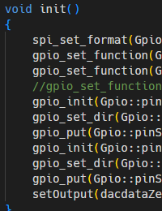

# Dexy Firmware

The [RP2040 microcontroller](https://www.raspberrypi.com/documentation/microcontrollers/rp2040.html)
in the Dexy module is programmed with firmware that is responsible for:
- Digital FM synthesis (its main job)
- Sending audio output to the DAC chip via SPI
- Handling the gate and CV inputs
- Implementing a user interface using the rotary encoder and OLED display
- Communicating with a computer over a USB-serial connection

The Dexy firmware is written in C++ using the
[Raspberry Pi Pico C/C++ SDK](https://github.com/raspberrypi/pico-sdk).
The Dexy module uses an [Adafruit KB2040](https://www.adafruit.com/product/5302) board
but the firmware can run on a
[Pi Pico](https://www.raspberrypi.com/documentation/microcontrollers/raspberry-pi-pico.html)
or other compatible board; my prototype used an
[Adafruit Feather RP2040](https://www.adafruit.com/product/4884).
To use a different RP2040 board, the I/O pin definitions in [Gpio.h](Gpio.h) must be
changed, and of course the PCB layout must be changed.

### Building the Firmware

Compiling the Dexy firmware requires the following tools:

- [CMake](https://cmake.org/)
- [Arm GNU Toolchain](https://developer.arm.com/downloads/-/arm-gnu-toolchain-downloads)
  (GCC compiler for Arm)
- [Raspberry Pi Pico C/C++ SDK](https://github.com/raspberrypi/pico-sdk)

[Here are step-by-step instructions](https://len42.github.io/rp2040-dev-setup.html)
for setting up a development environment on Windows using Visual Studio Code.

Instructions for installing the toolchain on Linux and Mac OS can be found in
[Getting Started with Raspberry Pi Pico](https://datasheets.raspberrypi.com/pico/getting-started-with-pico.pdf).

### Firmware Overview

The RP2040 microcontroller has two CPU cores, and the Dexy firmware uses both of them.

Core 0 reads the CV inputs (at the sample rate, called from an interrupt) and also runs
a task scheduler that executes various lower-priority tasks such as patch selection and
USB communication.

Core 1 runs the FM synthesis algorithm to generate audio output samples and sends the
output to the DAC chip. Audio output is generated at a sample rate of 49152 Hz, clocked
by a PWM timer interrupt.

The firmware stores 32 preset patches. The rotary encoder is used to select which patch
to play. There is no patch editing on the module - patches are editing using the
[DexyPatch software](../software/DexyPatch/) and downloaded to the module.
Downloaded patches are stored in flash memory so they are retained when the module is
turned off. Note, however, that updating the firmware will replace the patches with a
default set.

### FM Synthesis

The FM synthesis is loosely based on the Yamaha DX7 voice architecture (but only a
single voice is implemented). There are 6 operators, each consisting of a sine wave
oscillator and an envelope generator. The operators are combined according to one of
32 “algorithms” so that some operators are audio outputs and some operators modulate
another operator's frequency.

### Notes

It was challenging to get the FM synthesis code to run fast enough to keep up with the
49 kHz sample rate. [Here are some notes about performance.](../docs/performance.md)

Another challenge was getting accurate results from the 12-bit ADC in the RP2040 so
there is good (well, good enough) volt-per-octave pitch tracking across 10 octaves.
[More info here.](https://len42.github.io/rp2040-adc-accuracy.html)

The Dexy firmware does not support pitch tracking (keyboard tracking) for operator amplitude and envelope rate, as the DX7 does. This is a useful feature that may be
added in the future.

The Dexy firmware is open source and is published under the [MIT license](LICENSE).

## Software Used

* [GCC for Arm](https://developer.arm.com/downloads/-/arm-gnu-toolchain-downloads) 12.2.1
* [CMake](https://cmake.org/) 3.22.3
* [Python](https://www.python.org/) 3.10.2
* [Raspberry Pi Pico C/C++ SDK](https://github.com/raspberrypi/pico-sdk) 1.5.1
* [zpp_bits](https://github.com/eyalz800/zpp_bits) 4.4.15
* [pico-ssd1306](https://github.com/daschr/pico-ssd1306)
* [Dina font](https://www.dcmembers.com/jibsen/download/61/) 2.92

 © 2023 Len Popp CC BY This work is licensed under a <a rel="license" href="http://creativecommons.org/licenses/by/4.0/">Creative Commons Attribution 4.0 International License</a>.

