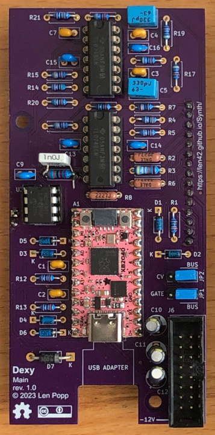
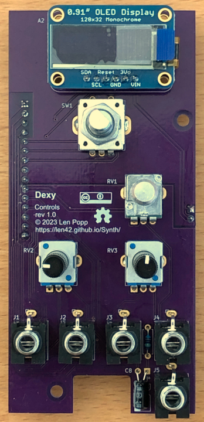

# Dexy Hardware

### Features

- 10 HP Eurorack module
- Based on an [Adafruit KB2040](https://www.adafruit.com/product/5302) board with an
[RP2040 microcontroller](https://www.raspberrypi.com/documentation/microcontrollers/rp2040.html)
(similar to [Raspberry Pi Pico](https://www.raspberrypi.com/documentation/microcontrollers/raspberry-pi-pico.html))
- Inputs: Gate, pitch (1V/oct), pitch mod, timbre mod
- Attenutators on the modulation inputs
- Gate and 1V/oct inputs can default to the Eurorack bus gate line (jumper-selectable) -
more info [here](https://len42.github.io/Synth/eurorack-bus-cv-gate.html)
- Timbre control knob
- Rotary encoder and OLED display for patch selection and note animations
- USB connection to download patches and firmware

### Notes

This module requires a 16-pin Eurorack power cable that supplies +5 V power in addition to +12 V and -12 V.

The [KB2040](https://www.adafruit.com/product/5302) microcontroller module is similar to a [Pi Pico](https://www.raspberrypi.com/documentation/microcontrollers/raspberry-pi-pico.html)
but it's smaller. The firmware will run on any Pico-compatible board with minor changes. (My prototype used an [Adafruit Feather RP2040](https://www.adafruit.com/product/4884)
but it turned out to be too big.)

The microcontroller board is powered by either the USB connection or the Eurorack +5 V supply, whichever is turned on. If both power supplies are on, a diode prevents them from fighting each other.

For the USB connection, I have the USB cable running through a hole in the front panel
and a right-angle adapter to the KB2040. It looks a bit janky and it's hard to plug
and unplug, but I was worried about running USB data lines from one PCB to the other
over a header connector. The data rate is only 12 MB/s (USB 1.1) so I think it would
have been OK to run the data lines to a USB-B connector on the controls PCB.

An OLED display and a rotary encoder are used for a user interface to the
microcontroller, mostly used for patch selection.

Analog CV inputs for pitch and timbre modulation are read by the RP2040's built-in
12-bit ADC. This ADC isn't great
([see here](https://len42.github.io/rp2040-adc-accuracy.html) for more info)
and a 14-bit ADC would give better results for the the 1V/octave pitch CV input.
I couldn't find a good, cheap, usable 14-bit ADC chip, so I'm sticking with the built-in
ADC.

The two pitch CV inputs - 1V/oct and modulation - are added together by an op-amp and
read by a single ADC channel, instead of having separate ADC inputs for the two inputs.
Same for the timbre control and timbre mod CV. These CV inputs need an op-amp stage to
scale them down to the RP2040's voltage range (0 to +3.3 V), so it's easy to add them
in hardware and use fewer ADC channels.

The audio output is generated digitally by the microcontroller and converted to an
analog signal by a [MCP4821](https://www.microchip.com/en-us/product/MCP4821)
DAC chip, which is followed by a reconstruction filter made of two Sallen-Key filter
stages.

The Dexy module is open source hardware. The hardware design is
published under the [Creative Commons Attribution license](http://creativecommons.org/licenses/by/4.0/).
Firmware and software are published under the [MIT license](../firmware/LICENSE).

### PCBs

PCB layouts are provided in KiCad and gerber formats. A PCB layout for a drilled front panel (with no labels) is also included.

The PCBs that I designed for this module can be ordered from OSH Park:
- [Main board](https://oshpark.com/shared_projects/SqPinUsc)
- [Controls board](https://oshpark.com/shared_projects/VcDtCyfD)
- [Front panel](https://oshpark.com/shared_projects/q5TKd42b)

Please note that I am a hobbyist, not a trained electronics engineer. No guarantees!

### Schematic

### Software Used

* [KiCad](https://www.kicad.org/) 7.0.2

 © 2023 Len Popp CC BY This work is licensed under a <a rel="license" href="http://creativecommons.org/licenses/by/4.0/">Creative Commons Attribution 4.0 International License</a>.

