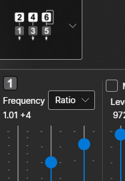
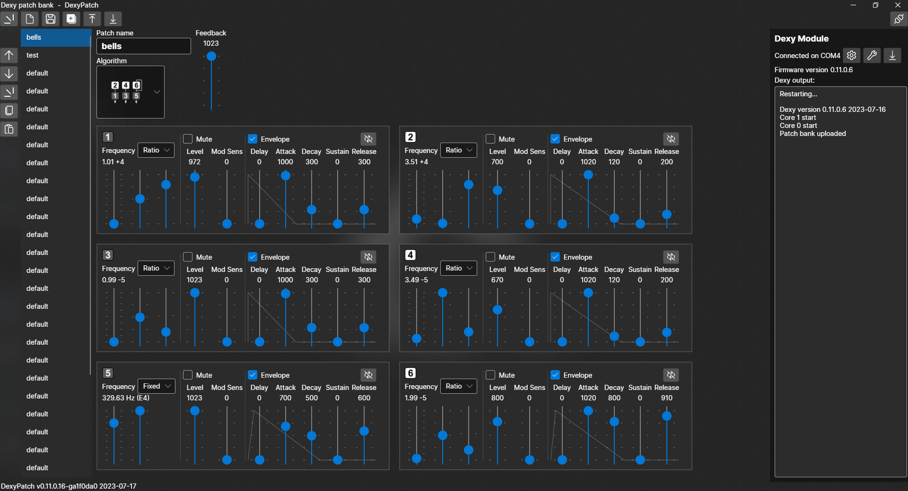

# DexyPatch Software

DexyPatch is a Windows application for editing patches for the Dexy module.

### Features

- Patch editing for the Dexy FM synthesis module
- Save and load patchbank files
- USB interface to the Dexy module:
    - Upload and download patchbanks
    - Download firmware to the module
    - Display status and debugging messages from the module
- Live patch editing: When editing a patchbank that was uploaded from the Dexy
    module, changes to the currently-playing patch are heard immedately

### Notes

DexyPatch is written using C#, .NET, and the
[Avalonia UI](https://github.com/avaloniaui/avalonia) app framework.
Those components are cross-platform, but the project was build on Windows with
[Microsoft Visual Studio](https://visualstudio.microsoft.com/downloads/)
and it may contain some Windows-specific code (in particular, for handling the
USB comm port connection). Some work would be needed to get it to build and run
on Mac OS or Linux.

DexyPatch is open source and is published under the [MIT license](LICENSE).

### Screenshot

### Software Used

* [Avalonia UI](https://github.com/avaloniaui/avalonia) 0.10.19
* [Microsoft Visual Studio 2022](https://visualstudio.microsoft.com/downloads/) Community Edition
* [Python](https://www.python.org/) 3.10.2
* [MakeVersionInfoP](https://github.com/Len42/MakeVersionInfoP) 
* [Windows 10](https://www.microsoft.com/en-ca/software-download/windows10)

 © 2023 Len Popp CC BY This work is licensed under a <a rel="license" href="http://creativecommons.org/licenses/by/4.0/">Creative Commons Attribution 4.0 International License</a>.

